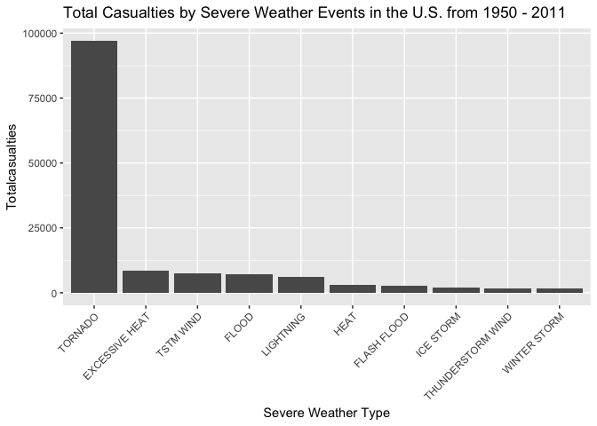
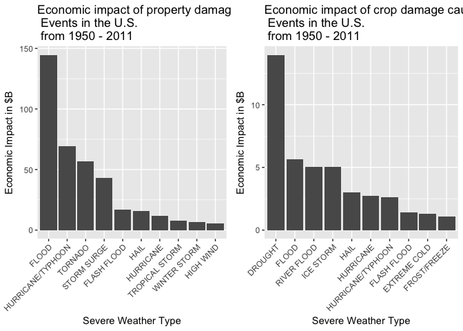

# Reproducible Research Project2
JP Van Steerteghem  
9/7/2017  
##The impact of severe weather events in the United States from 1950 to 2011

###SYNOPIS
In this study we investigate the impact of severe weather events in the United States using the [U.S. National Oceanic and Atmospheric Administration's (NOAA) storm database][1].   The objective of this study was to answer the following questions:

- which types of events have been most harmful with respect to population health?
- which types of events have had the greatest economic impact?


[1]:https://d396qusza40orc.cloudfront.net/repdata%2Fdata%2FStormData.csv.bz2/ "U.S. National Oceanic and Atmospheric Administration's (NOAA) storm database"

### LOADING AND PROCESSING THE DATA

The following R-packages were used in this study.

```r
setwd("/Users/jvanstee/datasciencecoursera/RepData_PeerAssessment2")
library(dplyr)
```

```
## 
## Attaching package: 'dplyr'
```

```
## The following objects are masked from 'package:stats':
## 
##     filter, lag
```

```
## The following objects are masked from 'package:base':
## 
##     intersect, setdiff, setequal, union
```

```r
library(ggplot2)
library(gridExtra)
```

```
## 
## Attaching package: 'gridExtra'
```

```
## The following object is masked from 'package:dplyr':
## 
##     combine
```

The data was downloaded from the course website and then decompressed.  

```r
  if(!file.exists("./Data")){dir.create("./Data")}
  fileUrl <- "https://d396qusza40orc.cloudfront.net/repdata%2Fdata%2FStormData.csv.bz2"
  download.file(fileUrl,destfile="./Data/StormData.csv.bz2")
  stormdata <- read.csv(bzfile("./Data/StormData.csv.bz2"))

#verify
str(stormdata)
```

```
## 'data.frame':	902297 obs. of  37 variables:
##  $ STATE__   : num  1 1 1 1 1 1 1 1 1 1 ...
##  $ BGN_DATE  : Factor w/ 16335 levels "1/1/1966 0:00:00",..: 6523 6523 4242 11116 2224 2224 2260 383 3980 3980 ...
##  $ BGN_TIME  : Factor w/ 3608 levels "00:00:00 AM",..: 272 287 2705 1683 2584 3186 242 1683 3186 3186 ...
##  $ TIME_ZONE : Factor w/ 22 levels "ADT","AKS","AST",..: 7 7 7 7 7 7 7 7 7 7 ...
##  $ COUNTY    : num  97 3 57 89 43 77 9 123 125 57 ...
##  $ COUNTYNAME: Factor w/ 29601 levels "","5NM E OF MACKINAC BRIDGE TO PRESQUE ISLE LT MI",..: 13513 1873 4598 10592 4372 10094 1973 23873 24418 4598 ...
##  $ STATE     : Factor w/ 72 levels "AK","AL","AM",..: 2 2 2 2 2 2 2 2 2 2 ...
##  $ EVTYPE    : Factor w/ 985 levels "   HIGH SURF ADVISORY",..: 834 834 834 834 834 834 834 834 834 834 ...
##  $ BGN_RANGE : num  0 0 0 0 0 0 0 0 0 0 ...
##  $ BGN_AZI   : Factor w/ 35 levels "","  N"," NW",..: 1 1 1 1 1 1 1 1 1 1 ...
##  $ BGN_LOCATI: Factor w/ 54429 levels ""," Christiansburg",..: 1 1 1 1 1 1 1 1 1 1 ...
##  $ END_DATE  : Factor w/ 6663 levels "","1/1/1993 0:00:00",..: 1 1 1 1 1 1 1 1 1 1 ...
##  $ END_TIME  : Factor w/ 3647 levels ""," 0900CST",..: 1 1 1 1 1 1 1 1 1 1 ...
##  $ COUNTY_END: num  0 0 0 0 0 0 0 0 0 0 ...
##  $ COUNTYENDN: logi  NA NA NA NA NA NA ...
##  $ END_RANGE : num  0 0 0 0 0 0 0 0 0 0 ...
##  $ END_AZI   : Factor w/ 24 levels "","E","ENE","ESE",..: 1 1 1 1 1 1 1 1 1 1 ...
##  $ END_LOCATI: Factor w/ 34506 levels ""," CANTON"," TULIA",..: 1 1 1 1 1 1 1 1 1 1 ...
##  $ LENGTH    : num  14 2 0.1 0 0 1.5 1.5 0 3.3 2.3 ...
##  $ WIDTH     : num  100 150 123 100 150 177 33 33 100 100 ...
##  $ F         : int  3 2 2 2 2 2 2 1 3 3 ...
##  $ MAG       : num  0 0 0 0 0 0 0 0 0 0 ...
##  $ FATALITIES: num  0 0 0 0 0 0 0 0 1 0 ...
##  $ INJURIES  : num  15 0 2 2 2 6 1 0 14 0 ...
##  $ PROPDMG   : num  25 2.5 25 2.5 2.5 2.5 2.5 2.5 25 25 ...
##  $ PROPDMGEXP: Factor w/ 19 levels "","-","?","+",..: 17 17 17 17 17 17 17 17 17 17 ...
##  $ CROPDMG   : num  0 0 0 0 0 0 0 0 0 0 ...
##  $ CROPDMGEXP: Factor w/ 9 levels "","?","0","2",..: 1 1 1 1 1 1 1 1 1 1 ...
##  $ WFO       : Factor w/ 542 levels ""," CI","%SD",..: 1 1 1 1 1 1 1 1 1 1 ...
##  $ STATEOFFIC: Factor w/ 250 levels "","ALABAMA, Central",..: 1 1 1 1 1 1 1 1 1 1 ...
##  $ ZONENAMES : Factor w/ 25112 levels "","                                                                                                                               "| __truncated__,..: 1 1 1 1 1 1 1 1 1 1 ...
##  $ LATITUDE  : num  3040 3042 3340 3458 3412 ...
##  $ LONGITUDE : num  8812 8755 8742 8626 8642 ...
##  $ LATITUDE_E: num  3051 0 0 0 0 ...
##  $ LONGITUDE_: num  8806 0 0 0 0 ...
##  $ REMARKS   : Factor w/ 436781 levels "","\t","\t\t",..: 1 1 1 1 1 1 1 1 1 1 ...
##  $ REFNUM    : num  1 2 3 4 5 6 7 8 9 10 ...
```

### WHAT WEATHER EVENTS HAVE BEEN MOST HARMFUL TO THE UNITED STATES POPULATION?


```r
#we subset the dataset to only contain variables significant for this analysis.
#EVTYPE = event type
#FATALITIES = fatalities
#INJURIES = injuries
#PROPDMG = property damage
#PROPDMGEXP = exponent value for property damage
#CROPDMG = crop damage
#CROPDMGEXP = exponent value for crop damage

stormdataPA2 <- select(stormdata, EVTYPE, FATALITIES, INJURIES, PROPDMG, PROPDMGEXP,CROPDMG, CROPDMGEXP)

#determine the top10 weather events causing fatalities
casualty_ordered_fatal <-stormdataPA2 %>% group_by(EVTYPE) %>%summarise(FATALITIES = sum(FATALITIES)) %>% arrange(desc(FATALITIES)) 
fatal_top10 <- casualty_ordered_fatal[1:10, ]

#determine the top10 weather events causing injuries
casualty_ordered_injury <-stormdataPA2 %>% group_by(EVTYPE) %>%summarise(INJURIES = sum(INJURIES)) %>% arrange(desc(INJURIES))
injury_top10 <- casualty_ordered_injury[1:10, ]

#determine top10 weather events causing casualties
casualty_total = aggregate(FATALITIES + INJURIES ~ EVTYPE, stormdataPA2, sum)
names(casualty_total) = c("EVTYPE","Totalcasualties")
casualty_ordered_total = arrange(casualty_total,desc(Totalcasualties))
casualties_top10 <- casualty_ordered_total[1:10, ]

fatal_top10
```

```
## # A tibble: 10 × 2
##            EVTYPE FATALITIES
##            <fctr>      <dbl>
## 1         TORNADO       5633
## 2  EXCESSIVE HEAT       1903
## 3     FLASH FLOOD        978
## 4            HEAT        937
## 5       LIGHTNING        816
## 6       TSTM WIND        504
## 7           FLOOD        470
## 8     RIP CURRENT        368
## 9       HIGH WIND        248
## 10      AVALANCHE        224
```

```r
injury_top10
```

```
## # A tibble: 10 × 2
##               EVTYPE INJURIES
##               <fctr>    <dbl>
## 1            TORNADO    91346
## 2          TSTM WIND     6957
## 3              FLOOD     6789
## 4     EXCESSIVE HEAT     6525
## 5          LIGHTNING     5230
## 6               HEAT     2100
## 7          ICE STORM     1975
## 8        FLASH FLOOD     1777
## 9  THUNDERSTORM WIND     1488
## 10              HAIL     1361
```

```r
casualties_top10
```

```
##               EVTYPE Totalcasualties
## 1            TORNADO           96979
## 2     EXCESSIVE HEAT            8428
## 3          TSTM WIND            7461
## 4              FLOOD            7259
## 5          LIGHTNING            6046
## 6               HEAT            3037
## 7        FLASH FLOOD            2755
## 8          ICE STORM            2064
## 9  THUNDERSTORM WIND            1621
## 10      WINTER STORM            1527
```

```r
#convert EVTYPE to factor to allow proper graphing
casualties_top10$EVTYPE <- as.character(casualties_top10$EVTYPE)
casualties_top10$EVTYPE <- factor(casualties_top10$EVTYPE, levels  =unique(casualties_top10$EVTYPE))


ggplot(casualties_top10, aes(EVTYPE, Totalcasualties))+geom_histogram(stat = "identity")+theme(axis.text.x = element_text(angle = 45,hjust = 1))+ xlab("Severe Weather Type") + 
  ggtitle("Total Casualties by Severe Weather Events in the U.S. from 1950 - 2011")
```

```
## Warning: Ignoring unknown parameters: binwidth, bins, pad
```

<!-- -->

### WHAT WEATHER EVENTS HAVE CAUSED THE GREATES ECONOMIC DAMAGE TO THE UNITED STATES?


```r
## Convert the property damage and crop damage data into comparable numerical forms. 
# PROPDMGEXP and CROPDMGEXP columns record contain a multiplier for each observation where we have Hundred (H), Thousand (K), Million (M) and Billion (B).

unique(stormdataPA2$PROPDMGEXP)
```

```
##  [1] K M   B m + 0 5 6 ? 4 2 3 h 7 H - 1 8
## Levels:  - ? + 0 1 2 3 4 5 6 7 8 B h H K m M
```

```r
stormdataPA2$PROPEXP[stormdataPA2$PROPDMGEXP == "+"] <- 0
stormdataPA2$PROPEXP[stormdataPA2$PROPDMGEXP == "-"] <- 0
stormdataPA2$PROPEXP[stormdataPA2$PROPDMGEXP == "?"] <- 0

# Assigning values for the property exponent data 
stormdataPA2$PROPEXP[stormdataPA2$PROPDMGEXP == "K"] <- 1000
stormdataPA2$PROPEXP[stormdataPA2$PROPDMGEXP == "M"] <- 1e+06
stormdataPA2$PROPEXP[stormdataPA2$PROPDMGEXP == ""] <- 1
stormdataPA2$PROPEXP[stormdataPA2$PROPDMGEXP == "B"] <- 1e+09
stormdataPA2$PROPEXP[stormdataPA2$PROPDMGEXP == "m"] <- 1e+06
stormdataPA2$PROPEXP[stormdataPA2$PROPDMGEXP == "0"] <- 1
stormdataPA2$PROPEXP[stormdataPA2$PROPDMGEXP == "5"] <- 1e+05
stormdataPA2$PROPEXP[stormdataPA2$PROPDMGEXP == "6"] <- 1e+06
stormdataPA2$PROPEXP[stormdataPA2$PROPDMGEXP == "4"] <- 10000
stormdataPA2$PROPEXP[stormdataPA2$PROPDMGEXP == "2"] <- 100
stormdataPA2$PROPEXP[stormdataPA2$PROPDMGEXP == "3"] <- 1000
stormdataPA2$PROPEXP[stormdataPA2$PROPDMGEXP == "h"] <- 100
stormdataPA2$PROPEXP[stormdataPA2$PROPDMGEXP == "7"] <- 1e+07
stormdataPA2$PROPEXP[stormdataPA2$PROPDMGEXP == "H"] <- 100
stormdataPA2$PROPEXP[stormdataPA2$PROPDMGEXP == "1"] <- 10
stormdataPA2$PROPEXP[stormdataPA2$PROPDMGEXP == "8"] <- 1e+08

# Calculating the property damage value
stormdataPA2$PROPDMGVAL <- stormdataPA2$PROPDMG * stormdataPA2$PROPEXP

unique(stormdataPA2$CROPDMGEXP)
```

```
## [1]   M K m B ? 0 k 2
## Levels:  ? 0 2 B k K m M
```

```r
# Assigning '0' to invalid exponent data
stormdataPA2$CROPEXP[stormdataPA2$CROPDMGEXP == "?"] <- 0

# Assigning values for the crop exponent data 
stormdataPA2$CROPEXP[stormdataPA2$CROPDMGEXP == "M"] <- 1e+06
stormdataPA2$CROPEXP[stormdataPA2$CROPDMGEXP == "K"] <- 1000
stormdataPA2$CROPEXP[stormdataPA2$CROPDMGEXP == "m"] <- 1e+06
stormdataPA2$CROPEXP[stormdataPA2$CROPDMGEXP == "B"] <- 1e+09
stormdataPA2$CROPEXP[stormdataPA2$CROPDMGEXP == "0"] <- 1
stormdataPA2$CROPEXP[stormdataPA2$CROPDMGEXP == "k"] <- 1000
stormdataPA2$CROPEXP[stormdataPA2$CROPDMGEXP == "2"] <- 100
stormdataPA2$CROPEXP[stormdataPA2$CROPDMGEXP == ""] <- 1

#calculating value for crop damage
stormdataPA2$CROPDMGVAL <- stormdataPA2$CROPDMG * stormdataPA2$CROPEXP

##determine the top10 weather events causing property damage
propdmg_impact <-stormdataPA2 %>% group_by(EVTYPE) %>%summarise(PROPDMGVAL = sum(PROPDMGVAL)) %>% arrange(desc(PROPDMGVAL)) 
propdmg_impact_top10 <- propdmg_impact[1:10, ]

###determine the top10 weather events causing crop damage
cropdmg_impact <-stormdataPA2 %>% group_by(EVTYPE) %>%summarise(CROPDMGVAL = sum(CROPDMGVAL)) %>% arrange(desc(CROPDMGVAL)) 
cropdmg_impact_top10 <- cropdmg_impact[1:10, ]

propdmg_impact_top10
```

```
## # A tibble: 10 × 2
##               EVTYPE   PROPDMGVAL
##               <fctr>        <dbl>
## 1              FLOOD 144657709807
## 2  HURRICANE/TYPHOON  69305840000
## 3            TORNADO  56947380616
## 4        STORM SURGE  43323536000
## 5        FLASH FLOOD  16822673978
## 6               HAIL  15735267513
## 7          HURRICANE  11868319010
## 8     TROPICAL STORM   7703890550
## 9       WINTER STORM   6688497251
## 10         HIGH WIND   5270046260
```

```r
cropdmg_impact_top10
```

```
## # A tibble: 10 × 2
##               EVTYPE  CROPDMGVAL
##               <fctr>       <dbl>
## 1            DROUGHT 13972566000
## 2              FLOOD  5661968450
## 3        RIVER FLOOD  5029459000
## 4          ICE STORM  5022113500
## 5               HAIL  3025954473
## 6          HURRICANE  2741910000
## 7  HURRICANE/TYPHOON  2607872800
## 8        FLASH FLOOD  1421317100
## 9       EXTREME COLD  1292973000
## 10      FROST/FREEZE  1094086000
```

```r
#convert EVTYPE to factor to allow proper graphing
propdmg_impact_top10$EVTYPE <- as.character(propdmg_impact_top10$EVTYPE)
propdmg_impact_top10$EVTYPE <- factor(propdmg_impact_top10$EVTYPE, levels = unique(propdmg_impact_top10$EVTYPE))

cropdmg_impact_top10$EVTYPE <- as.character(cropdmg_impact_top10$EVTYPE)
cropdmg_impact_top10$EVTYPE <- factor(cropdmg_impact_top10$EVTYPE, levels  =unique(cropdmg_impact_top10$EVTYPE))

#plotting graph showing the economic impact of severe weather events
propdmg_impact_top10_plot <- ggplot(propdmg_impact_top10, aes(EVTYPE, PROPDMGVAL/(10^9)))+geom_histogram(stat = "identity")+theme(axis.text.x = element_text(angle = 45,hjust = 1))+ xlab("Severe Weather Type") +ylab("Economic Impact in $B") + 
  ggtitle("Economic impact of property damage caused by Severe Weather\n Events in the U.S.\n from 1950 - 2011")
```

```
## Warning: Ignoring unknown parameters: binwidth, bins, pad
```

```r
cropdmg_impact_top10_plot <- ggplot(cropdmg_impact_top10, aes(EVTYPE, CROPDMGVAL/(10^9)))+geom_histogram(stat = "identity")+theme(axis.text.x = element_text(angle = 45,hjust = 1))+ xlab("Severe Weather Type") + ylab("Economic Impact in $B") + 
  ggtitle("Economic impact of crop damage caused by Severe Weather\n Events in the U.S.\n from 1950 - 2011")
```

```
## Warning: Ignoring unknown parameters: binwidth, bins, pad
```

```r
grid.arrange(propdmg_impact_top10_plot, cropdmg_impact_top10_plot, ncol = 2, right = 4, left = 4)
```

<!-- -->

###RESULTS
This study reveals that tornadoes have had the most harmful impact on US population health.  Over the measurement period tornadoes caused 5,633 fatalities and 91,346 injuries.

The study also reveals that the significant impact of severe weather events on the US economy.  The majority of the economic impact was due to property damage.  Floods caused almost $145B in property damage, while hurricanes caused $69B and tornadoes caused $57B in property damage.  While the economic impact of crop damage was less severe, drought still caused the most damage at $14B.
